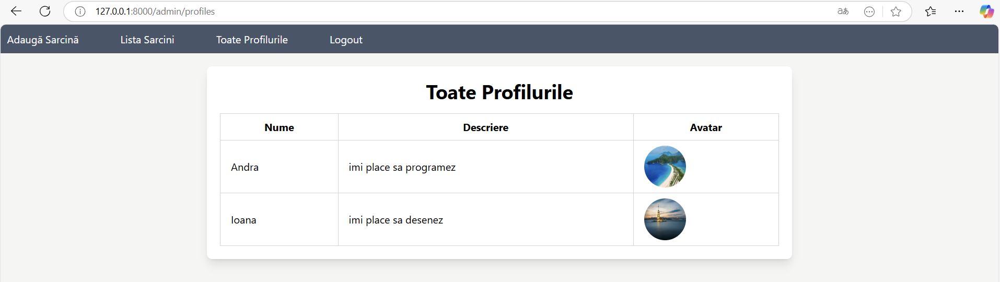

# Lucrarea de laborator nr. 5. Componentele de securitate în Laravel

### Instrucțiunile utilizate pentru rularea proiectului
1. Pornirea serverul Laravel
   ```bash
   php artisan serve
   ```

2. Compilarea fișierelor frontend
    ```bash
   npm run dev
   ```

### Instrucțiunile utilizate pentru configurarea structurii aplicației
_Crearea controllerului pentru admin și profil_
```bash
php artisan make:controller AdminController
php artisan make:controller ProfileController
```
_Crearea unei clase de cerere personalizată (Request)_
```bash
php artisan make:request ProfileRequest
```
_Crearea unui link simbolic pentru storage_
```bash
php artisan storage:link
```
_Crearea unui model Profile_
```bash
php artisan make:model Profile
```
_Crearea unei migrații pentru tabela profiles_
```bash
php artisan make:migration create_profiles_table --create=profiles
```
_Instalarea pachetului Laravel Permission_
```bash
composer require spatie/laravel-permission
```
_Publicarea fișierelor de configurare pentru pachetul spatie/laravel-permission_
```bash
php artisan vendor:publish --provider="Spatie\Permission\PermissionServiceProvider"
```
_Crearea unui seeder pentru administratori_
```bash
php artisan make:seeder CreateAdminSeeder 
```
_Crearea unei politici TaskPolicy_
```bash
php artisan make:policy TaskPolicy
```   

### Descrierea lucrării de laborator
În cadrul acestei lucrări de laborator, a fost necesar să se implemneteze autentificarea și autorizarea și protecția împotriva CSRF, precum și utilizarea mecanismelor integrate pentru gestionarea accesului.

### Documentația proiectului
#### 1. Descrierea aplicației
Aplicația are următoarele funcționlități noi:
- Autentificarea
- Autorizarea (Admin și utilizator)
- Delogarea

#### 2. Descrierea funcționalităților
- __Autentificarea__: Utilizatorul trebuie să se autentifice înainte de a accesa pagina destinată lui. El nu poate accesa altă pagină prin URL. Este redirecționat înapoi la formular.
- __Autorizarea (Admin și utilizator)__: 
-Administrator: are posibilitatea de a vizualiza panourile personale ale tuturor utilizatorilor. 
-Utilizator: poate vizualiza doar propriul panou personal, poate să adauge sarcini, să le editeze, să le comenteze și să le șteargă. El nu poate vedea alte profiluri sau realiza acțiuni asupra altor sarcini.
- __Delogarea__: Utilizatorul și adminul pot să se delogheze.

#### 3. Descrierea interfeței
Interfața utilizatorului este intuitivă, iar mesajele de eroare sunt sugestive.

#### 4. Structura directoarelor și fișierelor
- __Controllers__: Controlerele folosite
- __resources/views/tasks__: Pagina pentru afișarea listei de sarcini, a unei anumite sarcini, cât și pentru editare, ștergere și crearea unei noi sarcini. Paginile pentru înregistrare și autentificare și cele destinate userului și adminului.
- __Models__: Modelele folosite
- __database/migrations__: Migrațiile utilizate în cadrul lucurului cu baza de date pentru a popula baza de date cu date de test.
- __routes__: Rutele aplicației
- __Http/Requests__: Cererile personalizate
- __app/Providers/AuthServiceProvider__: Politicile și porțile
- __app/Policies/TaskPolicy__: Definirea politicilor

### Exemple de utilizare a proiectului

__Exemplul 1: Pagina de înregistrare__

Utilizatorul își poate crea un cont. Contul său nu poate avea o adresă de email care există deja în baza de date.

__Exemplul 1: Pagina de creare profil__

Utilizatorul își poate crea un profil. 

__Exemplul 2: Pagina de logare__

Utilizatorul și adminul pot să se logheze. În funcție de credențialele introduse, acesta este redirecționat pe pagina destinată lui, cu acțiunile permise doar lui.

__Exemplul 3: Pagina pentru admin__

Adminul poate vedea toate profilurile. De asemenea, el poate și să creeze o sarcină, să realizeze acțiuni asupra ei.

__Exemplul 4: Pagina pentru user__

Utilizatorul poate să își vizualizeze profilul, dar și să realizeze acțiuni asupra task-urilor create.

### Răspunsuri la întrebările de control
_Ce soluții integrate pentru autentificare oferă Laravel?_

Laravel oferă instrumente gata de utilizare prin biblioteca Laravel Breeze sau o soluție mai complexă, Laravel Jetstream. Aceste biblioteci simplifică implementarea autentificării, însă dezvoltatorul poate configura procesul manual dacă este necesară o personalizare completă.

_Ce metode de autentificare a utilizatorilor cunoașteți?_

Principalele metode de autentificare sunt:
- Autentificare pe bază de sesiuni
- Autentificare pe bază de token-uri 
- Autentificare prin OAuth (Google, Facebook, GitHub)
- Autentificare pe bază de email și parolă

_Care este diferența dintre autentificare și autorizare?_

Autentificarea este procesul de verificare a identității unui utilizator. 
Autorizarea este procesul de determinare a acțiunilor sau resurselor la care utilizatorul are acces după ce a fost autentificat cu succes.

_Cum se asigură protecția împotriva atacurilor CSRF în Laravel?_

Laravel protejează automat aplicațiile împotriva atacurilor CSRF printr-un token CSRF care este verificat la fiecare cerere POST. Tokenul este inclus în formularele HTML și verificat la procesarea cererilor pentru a se asigura că cererea provine dintr-o sursă validă.

### Lista surselor utilizate
Suportul de curs de pe git

https://github.com/MSU-Courses/frameworks-for-web-development/tree/main/ro

User permissions and roles in Laravel

https://www.honeybadger.io/blog/laravel-permissions-roles/

What Are Laravel Policies and How to Use Them to Control Access

https://www.twilio.com/en-us/blog/what-are-laravel-policies-and-how-to-use-them-to-control-access

