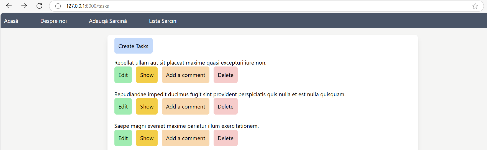
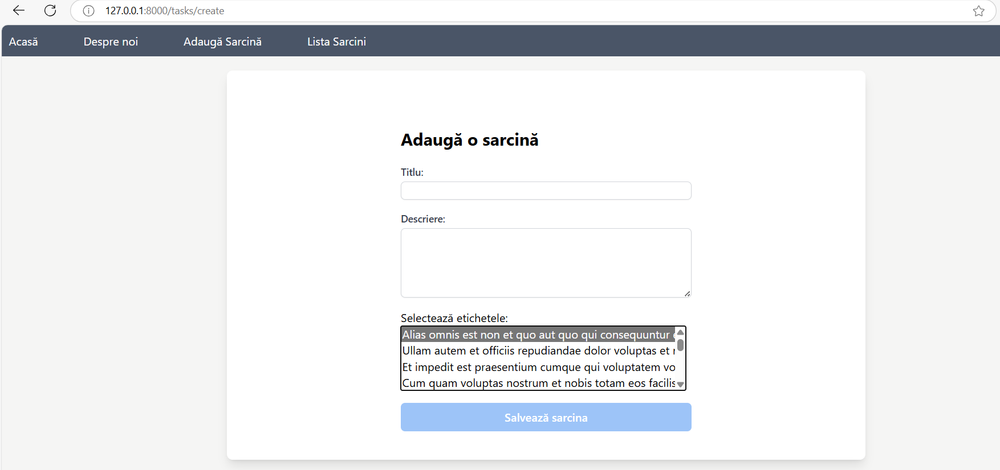
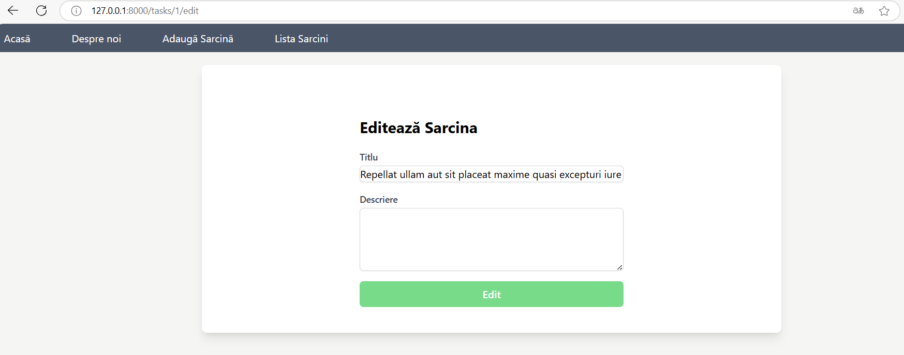
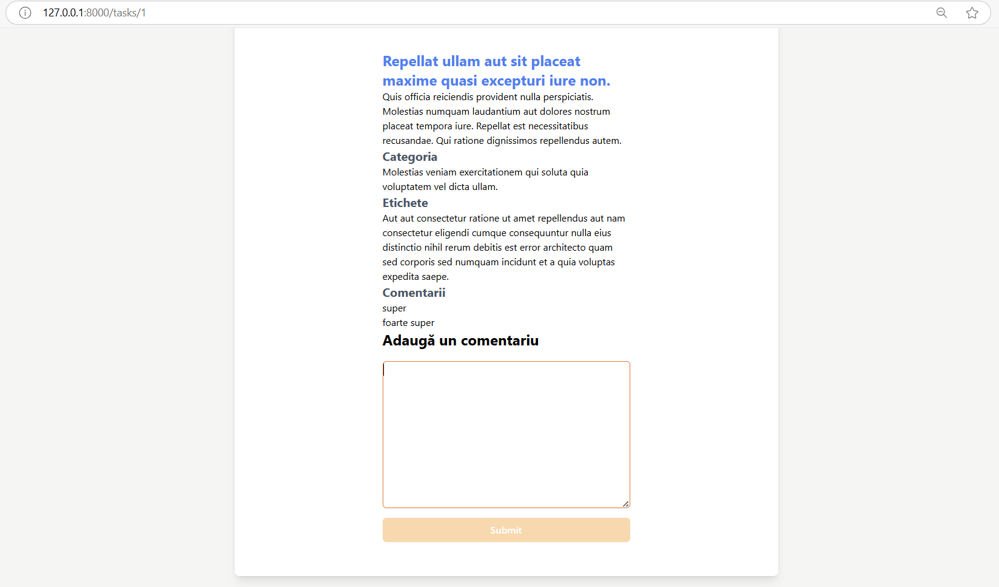

# Lucrarea de laborator nr. 3. Bazele lucrului cu baze de date în Laravel

### Instrucțiunile utilizate pentru rularea proiectului
1. Pornirea serverul Laravel
   ```bash
   php artisan serve
   ```

2. Compilarea fișierelor frontend
    ```bash
   npm run dev
   ```

### Instrucțiunile utilizate pentru configurarea structurii aplicației, utilizând bazele de date
_Crearea modelelor și migrațiilor_
```bash
php artisan make:model (Category -m / Task -m / Tag -m / Comment -m )
```

_Rularea migrațiilor_
```bash
php artisan migrate
```

_Crearea migrațților pentru a adăuga relații între tabele_
```bash
php artisan make:migration (add_category_id_to_tasks_table --table=tasks / create_task_tag_table)
```

_Generarea fabricilor_
```bash
php artisan make:factory (CategoryFactory --model=Category / TagFactory --model=Tag / TaskFactory --model=Task)
```

_Crearea seed-urilor_
```bash
php artisan make:seeder (CategorySeeder / TaskSeeder / TagSeeder)
```

_Crearea controller-ului pentru comentarii_
```bash
php artisan make:controller CommentController
```

### Descrierea lucrării de laborator
În cadrul acestei lucrări de laborator, a fost necesar să se dezvolte mini-aplicația web „To-Do App pentru echipe”, utilizând lucrul cu baze de date în Laravel. Pe parcursul realizării cestei lucrări, s-a învățat crearea migrațiilor, modelelor și seed-urilor, cât și utilizarea corectă a acestora.

### Documentația proiectului
#### 1. Descrierea aplicației
Aplicația Laravel a fost dezvoltată în continuare, utilizând bazele de date.
Aplicația are următoarele funcționlități noi:
- Vizualizarea listei de sarcini
- Adăugarea unei sarcini noi
- Editarea unei sarcini
- Vizualizarea detaliilor despre o anumită sarcină
- Adăugarea unui comentariu
- Ștergerea unei sarcini

#### 2. Descrierea funcționalităților
- __Vizualizarea listei de sarcini__: Membrii echipei pot vizualiza lista de sarcini, făcând click pe butonul "Vezi lista de sarcini" sau pe link-ul din meniu "Lista Sarcini" din meniu.
- __Adăugarea unei sarcini noi__: Membrii echipei pot accesa pagina, care va deschide un formular pentru a crea o sarcină nouă. Utilizatorul poate, de asemenea, să atașeze un tag sarcinii pe care o creează.
- __Editarea unei sarcini__: Membrii echipei pot edita o sarcină. Acest lucur se va efectua prin intermediul unui formular care se va deschide după apăsarea butonului __Edit__.
- __Vizualizarea detaliilor despre o anumită sarcină__: Membrii echipei pot vizualiza detaliile unei sarcini apăsând butonul __Show__.
- __Adăugarea unui comentariu__: Membrii echipei pot adăuga unul sau mai multe comentarii la o sarcină. Acest lucru se va efectua prin intermediul unui formular care se va deschide după apăsarea butonului __Add a comment__. 
- __Ștergerea unei sarcini__: Membrii echipei pot șterge o sarcină apăsând butonul __Delete__.


#### 3. Descrierea interfeței
Interfața utilizatorului este mult mai simplă și mai interactivă, datorită utilizării bazei de date. Acum, utilizatorul poate accesa toate funcționalitățile de pe pagina "Lista Sarcini". El poate efectua acțiuniile dorite pentru sarcina aleasă. 

#### 4. Structura directoarelor și fișierelor
- __Controllers__: Controlerele folosite
- __resources/views/tasks__: Pagina pentru afișarea listei de sarcini, a unei anumite sarcini, cât și pentru editare, ștergere și crearea unei noi sarcini
- __Models__: Modelele folosite
- __database/factories__: Fabricile utilizate pentru crearea datelor automate, în scopul testăriii
- __database/migrations__: Migrațiile utilizate în cadrul lucurului cu baza de date pentru a popula baza de date cu date de test.
- __database/seeders__: Seed-urile utilizate pentru a popula baza de date cu date de test
- __routes__: Rutele aplicației

### Exemple de utilizare a proiectului

__Exemplul 1: Pagina Lista Sarcini__

Aceasta este interfața pentru pagina Lista Sarcini. Ea conține lista tuturor sarcinilor și pentru fiecare sarcină opțiunile de editare (Edit), vizualizarea detaliilor despre sarcină (Show), adăugarea unui comentariu (Add a comment) și ștergerea unei sarcini (Delete). Aceste opțiuni pot fi accesate, făcând click pe butoanele respective. De asemenea, pe această pagină este prezent un buton _Create Task_ care va redirecționa utilizatorul către un formular destinat creării unei sarcini noi.

__Exemplul 2: Pagina Adaugă Sarcină__

Aceasta este interfața pentru pagina Adaugă Sarcină. Ea conține un formular destinat creării unei sarcini noi. Utilizatorul poate, de asemenea, să atașeze un tag sarcinii pe care o creează.

__Exemplul 3: Pagina pentru editarea unei sarcini__

Această pagină conține un formular destinat editării unei sarcini.

__Exemplul 4: Pagina entru afișarea unei anumite sarcini__

Aceasta este interfața pentru pagina de afișare a unei sarcini anumite. Utilizatorul poate vedea detaliile sarcinii selectate, poate adăuga un comentariu și viuzailiza comenatriile făcute anterior. 

### Răspunsuri la întrebările de control
_Ce sunt migrațiile și la ce se folosesc?_
Migrațiile sunt un instrument care permit gestionarea structurii bazei de date folosind cod. Migrațiile oferă posibilitatea de a aduce modificări în structura bazei de date (de exemplu, adăugarea, modificarea sau ștergerea de tabele și coloane), păstrând în același timp datele. 

_Ce sunt fabricile și seed-urile și cum simplifică procesul de dezvoltare și testare?_
Fabricile sunt clase care creează automat date de test pentru modele.
Seeder-ele sunt clase destinate pentru a popula baza de date cu date de test.
Ele simplifică procesul de dezvoltare și testare prin automatizarea generării de date și a instanțelor de obiecte.

_Ce este ORM? Care sunt diferențele dintre pattern-urile DataMapper și ActiveRecord?_
ORM (Object-Relational Mapping) este o tehnologie care permite interacțiunea cu baza de date prin intermediul obiectelor dintr-un limbaj de programare, fără a scrie interogări SQL directe. 
Diferențele dintre Active Record și Data Mapper:
- Active Record mapează direct clasa la tabelul bazei de date, în timp ce Data Mapper separă entitatea de logica bazei de date.
- În Active Record, orice modificare a structurii tabelului necesită modificări în codul aplicației. În Data Mapper, doar Mapper-ul trebuie actualizat, facilitând întreținerea.
- Data Mapper permite validări și manipulări înainte de atribuirea datelor, oferind mai mult control decât Active Record.

_Care sunt avantajele utilizării unui ORM comparativ cu interogările SQL directe?_
Avantajele utilizării unui ORM comparativ cu interogările SQL directe includ:
- Simplificarea codului, deoarece nu este necesară scrierea manuală a interogărilor SQL.
- Reducerea erorilor prin utilizarea obiectelor.
- Oferirea de funcționalități avansate precum gestionarea automată a relațiilor între obiecte.

_Ce sunt tranzacțiile și de ce sunt importante în lucrul cu bazele de date?_
Tranzacțiile sunt un set de operațiuni care permit gruparea mai multor interogări într-o singură operațiune logică, asigurând că toate modificările la baza de date au loc complet sau deloc. Ele sunt importante pentru menținerea integrității datelor, în cazul apariției unor erori.

### Lista surselor utilizate
Suportul de curs de pe git
https://github.com/MSU-Courses/frameworks-for-web-development/tree/main/ro

Database:Migartions - Foreign Key Constraints
https://laravel.com/docs/11.x/migrations#foreign-key-constraints

Laravel Many-to-Many: Seed Data with Factories - 3 Ways
https://laraveldaily.com/post/laravel-belongstomany-seed-data-factories

Eloquent: Relationships
https://laravel.com/docs/11.x/eloquent-relationships

Active Record vs Data Mapper pattern Laravel - InfinityPP
https://www.infinitypp.com/software-patterns/activerecord-vs-datamapper-pattern-php-laravel/
