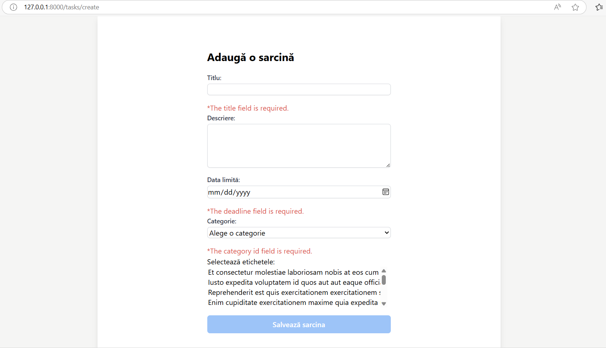
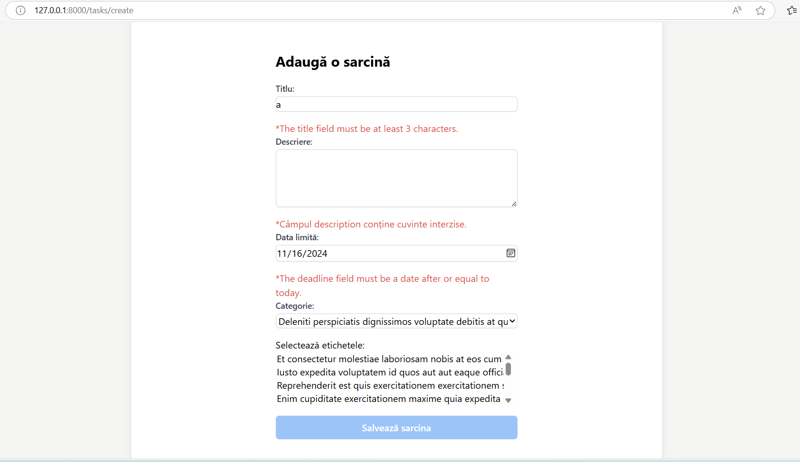
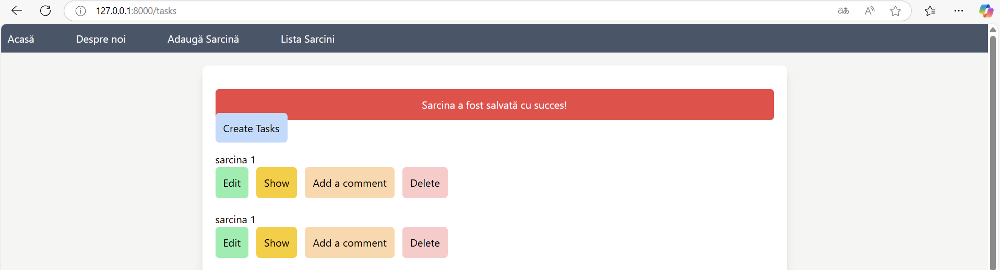
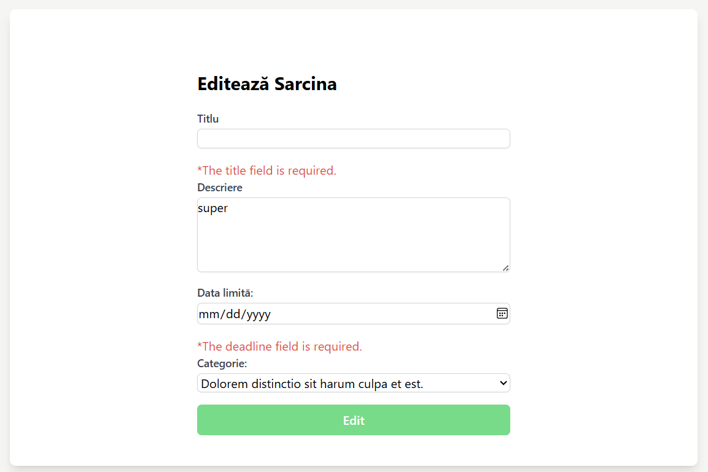
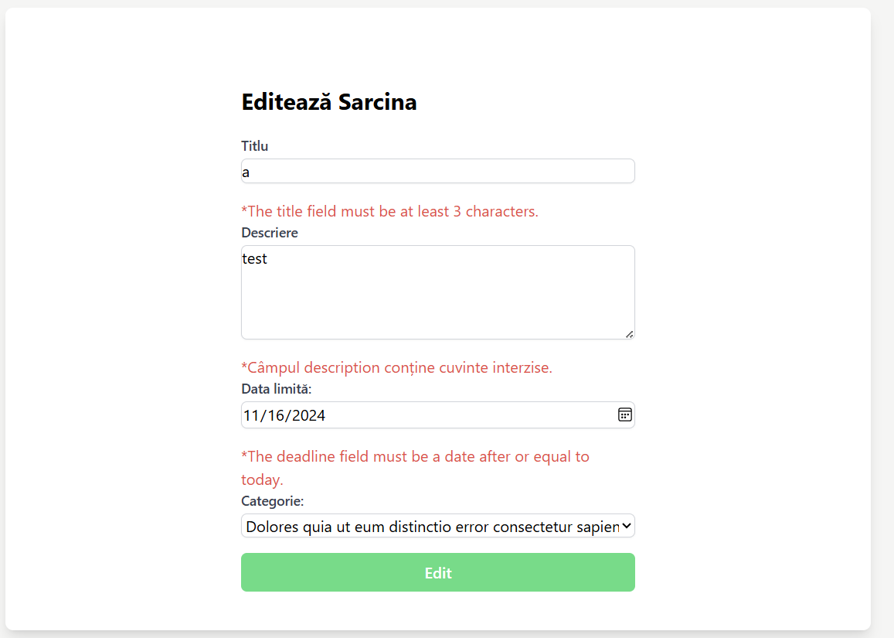
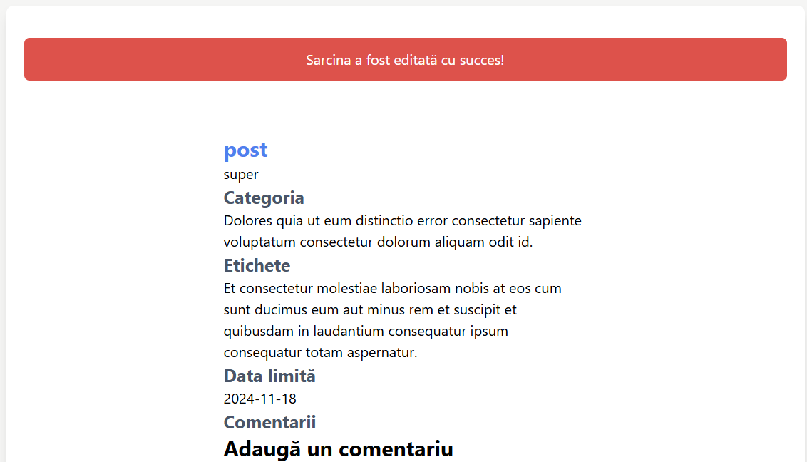

# Lucrarea de laborator nr. 4. Formulare și validarea datelor

### Instrucțiunile utilizate pentru rularea proiectului
1. Pornirea serverul Laravel
   ```bash
   php artisan serve
   ```

2. Compilarea fișierelor frontend
    ```bash
   npm run dev
   ```

### Instrucțiunile utilizate pentru configurarea structurii aplicației, utilizând bazele de date
_Crearea unei clase de cerere personalizată (Request)_
```bash
php artisan make:request CreateTaskRequest 
php artisan make:request UpdateTaskRequest
```

_Rularea unei reguli personalizate_
```bash
php artisan make:rule NoRestrictedWords
```

### Descrierea lucrării de laborator
În cadrul acestei lucrări de laborator, a fost necesar să se dezvolte securitatea mini-aplicației web „To-Do App pentru echipe”, implementând verificarea datelor pe partea de server pentru a preveni vulnerabilități precum XSS și CSRF. Pe parcursul realizării lucrării de laborator, s-au învățat principii precum validarea datelor pe server, a regulilor de validare predefinite și personalizate, precum și învățarea gestionării erorilor și asigurarea securității datelor. 

### Documentația proiectului
#### 1. Descrierea aplicației
Aplicația are următoarele funcționlități noi:
- Validarea formularului de creare și editare
- Utilizarea mesajelor flash
- Protecția împotriva CSRF

#### 2. Descrierea funcționalităților
- __Validarea formularului de creare și editare__: Atunci când utilizatorul dorește să adauge o sarcină nouă sau să editeze una existentă are loc validarea datelor, astfel încât aplicația să fie securizată. Utilziatorului îi apar mesaje informative, astfel că erorile sunt gestionate într-un mod eficient și clar.
- __Utilizarea mesajelor flash__: După ce utilizatorul adaugă o sarcină nouă sau editează una existentă, utilizatorului îi apare un mesaj informativ despre starea cererii lui. 
- __Protecția împotriva CSRF__: S-a folosit protecția CSRF pentru a preveni atacurile de tip Cross-Site Request Forgery. Laravel adaugă un token unic în formulare, care este validat pe server pentru a asigura că cererea provine de la utilizatorul autenticat.

#### 3. Descrierea interfeței
Interfața utilizatorului este una intuitivă, deoarece oferă mesaje clare utilizatorului atunci când acesta nu introduce unele date corect sau nu competează unele câmpuri care sunt obligatorii.

#### 4. Structura directoarelor și fișierelor
- __Controllers__: Controlerele folosite
- __resources/views/tasks__: Pagina pentru afișarea listei de sarcini, a unei anumite sarcini, cât și pentru editare, ștergere și crearea unei noi sarcini
- __Models__: Modelele folosite
- __database/migrations__: Migrațiile utilizate în cadrul lucurului cu baza de date pentru a popula baza de date cu date de test.
- __routes__: Rutele aplicației
- __Http/Requests__: Cererile personalizate
- __Rules__: Regula personalizată

### Exemple de utilizare a proiectului

__Exemplul 1: Pagina Creare Sarcină-Câmpuri goale__

Dacă utilizatorul lasă câmpurile goale, acesta primește mesaje de eroare pentru fiecare câmp obligator.

__Exemplul 2: Pagina Creare Sarcină-Câmpuri greșite__

Dacă utilizatorul completează câmpurile greșit, acesta primește mesaje de eroare pentru fiecare câmp cu privire la ce trebuie să conțină acesta. De asemenea, cuvintele interzise sunt, de asemenea, validate. Ele nu sunt permise în câmpul description. 

__Exemplul 3: Pagina Principală-Mesaj de succes__

Dacă utilizatorul completează câmpurile corect, acesta primește un mesaj de informare că sarcina a fost adăugată. cu succes

__Exemplul 4: Pagina pentru editarea unei sarcini-Câmpuri goale__

Dacă utilizatorul lasă câmpurile goale, acesta primește mesaje de eroare pentru fiecare câmp obligator.

__Exemplul 5: Pagina pentru editarea unei sarcini-Câmpuri greșite__

Dacă utilizatorul completează câmpurile greșit, acesta primește mesaje de eroare pentru fiecare câmp cu privire la ce trebuie să conțină acesta. De asemenea, cuvintele interzise sunt, de asemenea, validate. Ele nu sunt permise în câmpul description. 

__Exemplul 6: Pagina pentru afișarea unei anumite sarcini-Mesaj de succes__

Dacă utilizatorul completează câmpurile corect, acesta primește un mesaj de informare că sarcina a fost editată cu succes.

### Răspunsuri la întrebările de control
_Ce este validarea datelor și de ce este necesară?_

Validarea datelor reprezintă procesul prin care informațiile trimise de utilizatori prin formulare sunt verificate pentru a fi corecte, complete și în formatul așteptat. Este esențială deoarece previne erorile cauzate de introducerea unor date incorecte și protejează aplicația de posibile atacuri, cum ar fi SQL injection, asigurând în același timp funcționarea corectă a aplicației.

_Cum se asigură protecția formularului împotriva atacurilor CSRF în Laravel?_

Laravel protejează formularele împotriva atacurilor CSRF (Cross-Site Request Forgery) prin includerea unui token unic în fiecare formular. Acest token este verificat automat de framework la procesarea cererilor, iar dacă lipsește sau nu este valid, cererea este respinsă.

_Cum se creează și utilizează clasele personalizate de cerere (Request) în Laravel?_

Clasele personalizate de cerere în Laravel se creează folosind comanda artisan - php artisan make:request. Aceste clase sunt utilizate pentru a centraliza logica de validare a datelor, definind regulile în metoda rules. Într-un controller, o astfel de clasă se folosește ca parametru al metodei, iar datele validate sunt disponibile automat.

_Cum se protejează datele împotriva atacurilor XSS la afișarea în vizualizare?_

Protecția împotriva atacurilor XSS (Cross-Site Scripting) se realizează automat în Laravel prin funcția {{ }} folosită la afișarea datelor în vizualizări. Aceasta scapă orice cod HTML sau JavaScript potențial periculos, afișându-l ca text brut. 

### Lista surselor utilizate
Flash Messages

https://laravel-livewire.com/docs/2.x/flash-messages

Custom rule for validate input does not contain bad words

https://stackoverflow.com/questions/67783703/custom-rule-for-validate-input-does-not-contain-bad-words